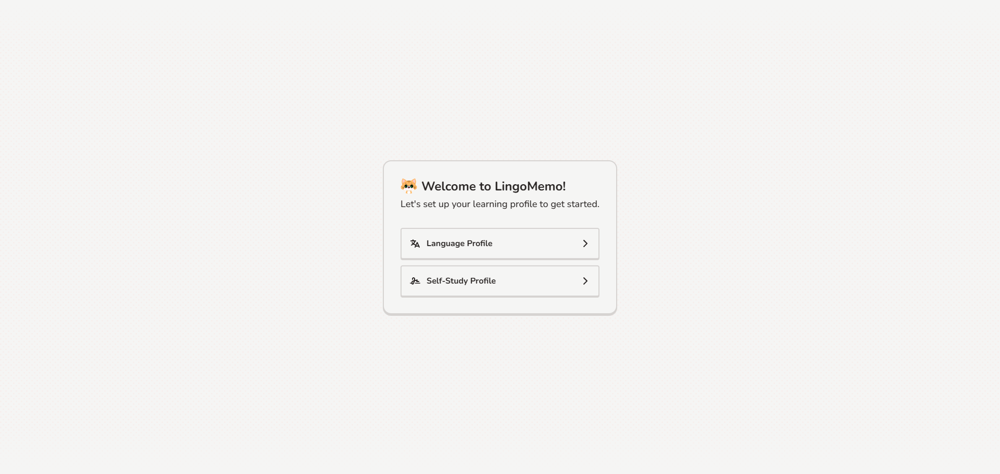
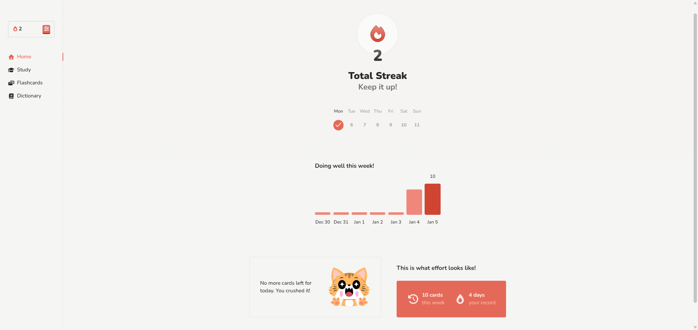
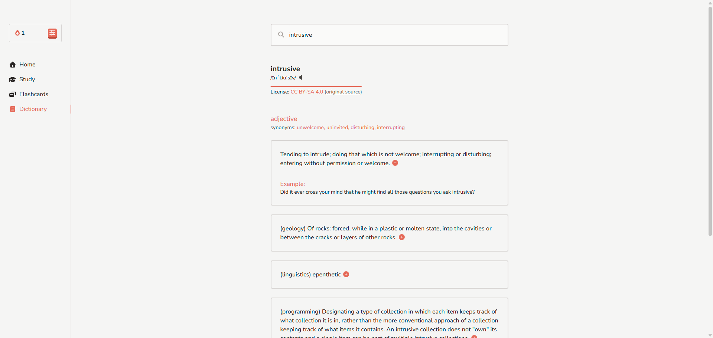
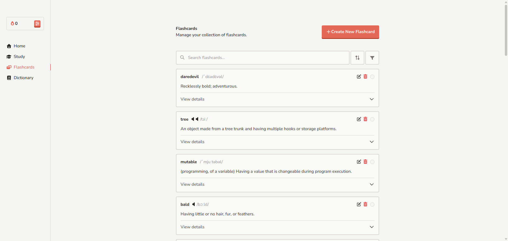
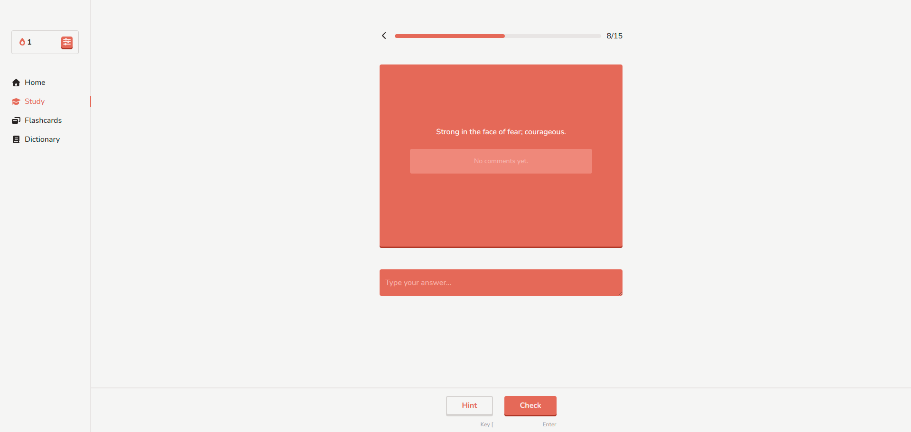
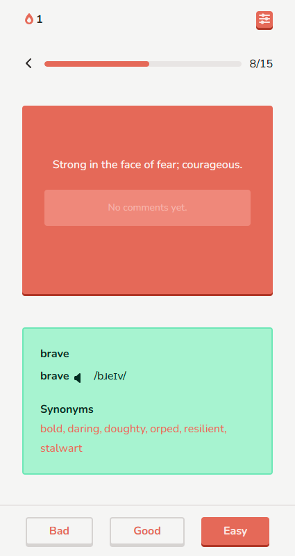
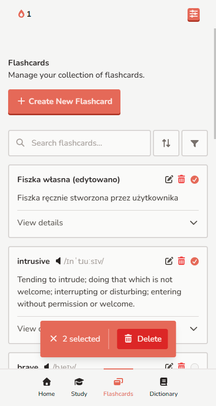

# LingoMemo

[](https://nextjs.org/)
[](https://www.typescriptlang.org/)
[](https://supabase.com/)
[](https://tailwindcss.com/)
[-blue>)](#license)

**LingoMemo** is a lightning-fast language learning application powered by the Spaced Repetition algorithm. Learn languages (or anything else) efficiently through intelligent flashcards, beautiful design, and a frictionless user experience.

🚀 **Live:** [https://lingomemo.vercel.app/](https://lingomemo.vercel.app/)

---

## Screenshots









---

## About The Project

LingoMemo is a production-ready language learning platform designed for maximum efficiency and user engagement. Whether you're learning a new language or mastering any subject through flashcards, LingoMemo adapts to your pace using the proven **Spaced Repetition** technique.

### Why LingoMemo?

- **Turbo-charged Performance:** With the slowest measured Interaction to Next Paint (INP) at just **24ms**, LingoMemo delivers an exceptionally smooth experience on any device - mobile, tablet, or desktop.
- **Mobile-First Design:** Crafted with mobile users in mind, featuring full Dark/Light mode support for comfortable learning at any time of day.
- **Intelligent Learning:** The platform supports an unlimited number of learning profiles, allowing you to learn multiple languages or subjects with separate streak tracking and statistics per profile.
- **Frictionless Vocabulary:** Integrated dictionary with one-click flashcard creation directly from definitions - no copy-pasting required.
- **Privacy & Control:** Self-host on your infrastructure or use the official deployment. Your learning data stays yours.

---

## Key Features

- ✅ **Multi-Language & Multi-Profile Learning** - Create unlimited learning profiles for different languages or subjects. Each profile maintains its own flashcard collection, statistics, and streak tracking.
- ✅ **Dictionary Integration** - Search definitions in real-time from `freedictionaryapi.com`. Audio pronunciations (English only) powered by `api.dictionaryapi.dev`. Create flashcards with a single click.

- ✅ **Smart Flashcard Management** - Easily create, edit, and organize flashcards. Support for synonyms, examples, and custom notes.

- ✅ **Advanced Statistics Dashboard** - Track your progress with:
  - Daily streak counter
  - Longest streak record
  - Weekly activity chart (last 7 days)
  - Total cards reviewed per week

- ✅ **Spaced Repetition Algorithm** - Modified SuperMemo-2 implementation with simplified grading (Bad, Good, Easy ratings) and optimized intervals for accelerated learning.

- ✅ **OAuth Authentication** - Secure login via Supabase, supporting Google OAuth provider.

- ✅ **Dark & Light Themes** - Full theme support for comfortable studying in any lighting condition.

- ✅ **Responsive Design** - Perfectly optimized for mobile, tablet, and desktop displays.

- ✅ **Timezone-Aware Tracking** - All reviews logged in UTC with automatic timezone conversion for accurate daily streaks.

---

## The Spaced Repetition Algorithm

LingoMemo implements a **modified SuperMemo-2 (SM-2) algorithm** optimized for accelerated language learning:

### Simplified Grading Scale

Instead of the traditional 0-5 scale, LingoMemo uses three intuitive grades:

- **0** - Complete blackout (incorrect answer)
- **3** - Correct answer after hesitation
- **5** - Perfect, immediate recall

### Interval Calculation

The algorithm applies these rules to calculate the next review date:

1. **On incorrect answer (grade = 0):**
   - Interval resets to 0 (card returns to today's review queue)
   - Continue reviewing until the card is answered correctly

2. **On correct answers (grade = 3 or 5) with interval < 6 days:**
   - Interval is set to exactly 6 days (skipping the standard 1-day step)
   - This accelerates learning by removing cards from daily rotation after first correct review

3. **On correct answers with interval ≥ 6 days:**
   - New interval = Round(current interval × E-Factor)

### E-Factor (Easiness Factor) Adjustment

The E-Factor is adjusted using the standard SM-2 formula:

$$EF' = EF + (0.1 - (5 - q) \times (0.08 + (5 - q) \times 0.02))$$

Where:

- `q` is the grade (3 or 5)
- E-Factor is constrained between **1.3** and **2.5**

Higher E-Factors indicate easier cards that require longer intervals; lower factors indicate harder cards needing more frequent review.

### UTC-Based Review Logging

- All reviews are logged using **UTC timestamps** to ensure consistent behavior across timezones
- Each flashcard review is unique per day (one review per card per day maximum)
- Database transactions ensure atomicity: review log + flashcard update occur together
- Luxon library handles all temporal calculations with timezone awareness

---

## Key Dependencies & Tech Stack

### Frontend

- **Framework:** [Next.js](https://nextjs.org/) – React-based full-stack framework with App Router
- **Language:** [TypeScript](https://www.typescriptlang.org/) – Type-safe JavaScript
- **Styling:** [Tailwind CSS](https://tailwindcss.com/) + [PostCSS](https://postcss.org/)
- **UI Components:** [Headless UI](https://headlessui.dev/) – Accessible component primitives
- **State Management:** [TanStack React Query](https://tanstack.com/query/latest) – Data fetching & caching
- **Animation:** [Motion](https://motion.dev/) – Smooth animations and transitions
- **Theme Management:** [next-themes](https://github.com/pacocoursey/next-themes) – Dark/Light mode support
- **Icons:** [FontAwesome](https://fontawesome.com/) – Professional icon library
- **Toasts:** [react-toastify](https://fkhadra.github.io/react-toastify/introduction) – Toast notifications
- **Utilities:** [Lodash](https://lodash.com/), [clsx](https://github.com/lukeed/clsx), [tailwind-merge](https://github.com/dcastil/tailwind-merge)

### Backend & Database

- **Authentication:** [Supabase Auth](https://supabase.com/auth) – OAuth & session management
- **Database:** [PostgreSQL](https://www.postgresql.org/) via [Supabase](https://supabase.com/)
- **ORM:** [Prisma](https://www.prisma.io/) with PostgreSQL adapter
- **Adapter:** [Prisma Accelerate](https://www.prisma.io/accelerate) – Connection pooling
- **Date/Time:** [Luxon](https://moment.github.io/luxon/) – Timezone-aware date handling

### Dev Tools

- **Code Quality:** [ESLint](https://eslint.org/), [Prettier](https://prettier.io/)
- **Build & Deployment:** [Vercel Analytics](https://vercel.com/analytics) & [Speed Insights](https://vercel.com/analytics/speed-insights)
- **Task Runner:** npm scripts

---

## Project Structure

```
LingoMemo/
├── app/                          # Next.js App Router structure
│   ├── (marketing)/              # Public marketing pages
│   │   ├── page.tsx              # Homepage
│   │   ├── credits/              # Credits page
│   │   ├── privacy/              # Privacy policy
│   │   └── terms/                # Terms of service
│   ├── (protected)/              # Authenticated routes (requires login)
│   │   ├── home/                 # Dashboard with statistics
│   │   ├── dictionary/           # Dictionary search & lookup
│   │   ├── flashcards/           # Flashcard management
│   │   ├── study/                # Study/review interface
│   │   └── preferences/          # User settings
│   ├── (setup)/                  # Onboarding flow
│   │   └── setup/                # Profile creation wizard
│   ├── @modal/                   # Modal slot for intercepting routes
│   ├── api/                      # API routes
│   ├── auth/                     # Authentication routes
│   ├── layout.tsx                # Root layout
│   └── globals.css               # Global styles
├── components/                   # Reusable React components
│   ├── Form/                     # Form components (Input, Select, etc.)
│   ├── NavigationItems/          # Navigation menu
│   ├── ProfileCreation/          # Onboarding components
│   └── [other shared components]
├── hooks/                        # Custom React hooks
├── lib/                          # Utility functions & helpers
│   ├── actions/                  # Server actions
│   ├── generated/
│   │   └── prisma/               # Generated Prisma Client
│   ├── supabase/                 # Supabase client instances
│   └── [other lib files]
├── types/                        # TypeScript type definitions
├── public/                       # Static assets
├── prisma/                       # Database schema & migrations
│   ├── schema.prisma             # Prisma schema definition
│   └── client.ts                 # Prisma Client instance
├── .env                          # Environment variables
├── next.config.ts                # Next.js configuration
├── tsconfig.json                 # TypeScript configuration
├── tailwind.config.ts            # Tailwind CSS configuration
├── eslint.config.mjs             # ESLint rules
├── prisma.config.ts              # Prisma configuration
└── package.json                  # Project dependencies & scripts
```

---

## Getting Started

### Prerequisites

- **Node.js** 18+ and **npm** 9+ (or yarn/pnpm)
- **PostgreSQL** database (or Supabase account for cloud hosting)
- **Supabase** account for authentication
- **Git**

### Installation & Local Development

#### 1. Clone the Repository

```bash
git clone https://github.com/DanielCachro/LingoMemo.git
cd lingomemo
```

#### 2. Install Dependencies

```bash
npm install
```

#### 3. Set Up Environment Variables

Create a `.env` file in the project root with the following variables:

```env
# Database Configuration
DATABASE_URL=your_postgresql_connection_string
DIRECT_URL=your_direct_database_connection_string

# Supabase Configuration
NEXT_PUBLIC_SUPABASE_URL=your_supabase_url
NEXT_PUBLIC_SUPABASE_PUBLISHABLE_KEY=your_supabase_publishable_key

# App Configuration
NEXT_PUBLIC_BASE_URL=your_actual_base_url (e.g., http://localhost:3000 for local dev)
```

**How to get these values:**

- Sign up at [Supabase](https://supabase.com/)
- Create a new project and navigate to **Connect → ORM → Prisma**
- Copy `DATABASE_URL` and `DIRECT_URL`
- For `NEXT_PUBLIC_SUPABASE_URL` and `NEXT_PUBLIC_SUPABASE_PUBLISHABLE_KEY`, find them under **Connect → Framework → Next.js**
- For `NEXT_PUBLIC_BASE_URL`, use http://localhost:3000 for local development. In production, this must be set to your actual domain (e.g., https://lingomemo.vercel.app)

#### 4. Set Up the Database

Prisma will automatically generate the client on `npm install` (postinstall script). To apply migrations:

```bash
npm prisma migrate dev
```

#### 5. Start the Development Server

```bash
npm run dev
```

The application will be available at `http://localhost:3000`

### Common Commands

```bash
# Development
npm run dev              # Start development server with hot reload

# Building
npm run build            # Build for production (includes Prisma generation)

# Production
npm run start            # Start production server

# Database
npx prisma studio       # Open Prisma Studio (visual DB explorer)
npx prisma migrate dev  # Create and apply new migration
npx prisma migrate reset # Reset database (dev only!)
npx prisma generate     # Regenerate Prisma Client
```

---

## Deployment

LingoMemo is designed to work seamlessly on **Vercel**, but can be deployed to any Node.js hosting provider.

### Deploy to Vercel (Recommended)

Vercel is optimized for Next.js and provides the best performance:

1. **Connect Your Repository**
   - Push your code to GitHub, GitLab, or Bitbucket
   - Go to [Vercel Dashboard](https://vercel.com/)
   - Click **Add New → Project** and import your repository

2. **Configure Environment Variables**
   - In the Vercel project settings, go to **Settings → Environment Variables**
   - Add all variables from your `.env`:
     - `DATABASE_URL`
     - `DIRECT_URL`
     - `NEXT_PUBLIC_SUPABASE_URL`
     - `NEXT_PUBLIC_SUPABASE_PUBLISHABLE_KEY`
     - `NEXT_PUBLIC_BASE_URL` (Set this to your production Vercel domain, e.g., `https://lingomemo.vercel.app` - without the trailing slash)

3. **Deploy**
   - Click **Deploy**
   - Vercel automatically builds and deploys your app
   - Your site is live! (URL provided in dashboard)

4. **Automatic Deployments**
   - Every push to your main branch triggers an automatic redeploy
   - Preview deployments for pull requests are generated automatically

### Deploy to Other Platforms

For deployment to other hosts (AWS, DigitalOcean, etc.):

1. Ensure Node.js 18+ is installed on your server
2. Clone the repository and install dependencies
3. Build the application: `npm run build`
4. Set environment variables on your hosting platform
5. Start the server: `npm run start`

Make sure your platform supports:

- PostgreSQL database connections
- Node.js 18+ runtime
- Environment variable configuration

---

## License

This project is available for free, personal, non-commercial self-hosting and use. Any public hosting, distribution, or commercial use requires explicit written permission from the author. For inquiries, contact: danielcachro@gmail.com.

---

## Support & Contribution

Found a bug or have a feature request? Feel free to [Report an Issue](https://github.com/DanielCachro/lingomemo/issues).

Contributions are welcome!.

---

## Acknowledgments

- [Supermemo 2 Algorithm](https://super-memory.com/english/ol/sm2.htm) – The foundation of our spaced repetition implementation
- [Free Dictionary API](https://www.freedictionaryapi.com/) and [Dictionary API](https://dictionaryapi.dev/) – Providing free access to English definitions
- [Supabase](https://supabase.com/) – Postgres development platform and authentication
- [Vercel](https://vercel.com/) – Next.js deployment platform

---

**Built with ❤️ for language learners worldwide.**

_Readme Last Updated: 2026_
